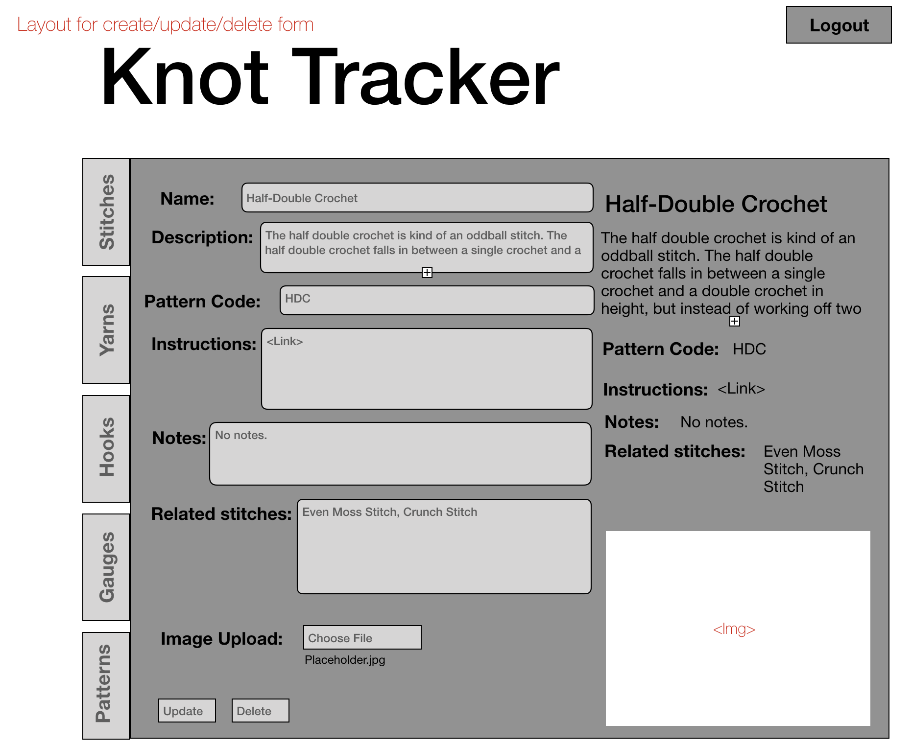

# About This Project

This app is designed to help crocheters track the various elements of crochet. Gauges are something a crocheter creates to test the number of stitches they have in a 4” section, and they have 4 main variables: hook, yarn, stitch, and tension. The first 3 are provided in a pattern, but tension will vary based on the person and is not tangible in the same way. For this reason, typically one would create a new gauge for every single project, which is time consuming. The goal of this is to be able to reference old gauges based on the other 3 factors, because inevitably they would repeat in different patterns, and since they are tied to individuals’ accounts, tension should also be consistent, making them reusable. Additionally, it would be a helpful tool to simply track various materials and outcomes.  
backend code accessible [here](https://github.com/julianadepp/crochet)
app accessible [here](https://julianadepp.github.io/crochet-app-frontend/#/)
## Tech

- React.js
- AWS S3
- CSS
- Flickity library (Javascript and CSS)
- react-router
- deployed with gh-pages 

## Current Works in Progress

- setting up accounts and linking it to frontend
- giving each category full functionality. The pieces are there but need to be applied for full CRUD
- CSS and flickity adjustments so selected items are properly highlighted in carousel; flex box adjustments so detail view is consistent
- loading screen while backend (hosted on heroku free version) loads up data

## Future Goals

- DRY up the code! possibly create and implement more generic custom hook to use across categories, as currently there is obviously lots of repetition.
- improved instructions regarding requirements in Create and Update components
- include Patterns components 
- continued CSS tweaks to move toward wireframe goal 
- create option for image from online OR uploaded from computer
- add starter tutorial

## Wireframes

